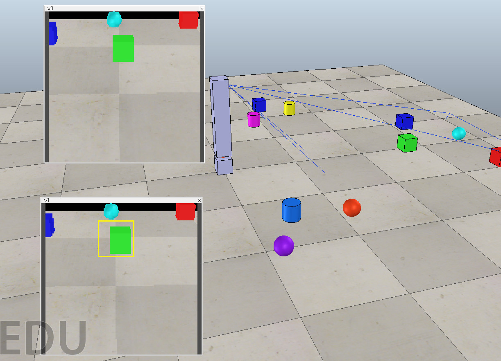

V-Rep API python OpenCV demo
============================

Demo for track green object by OpenCV.

Scenario:

* Vision Sensor `v0` get image from 3d scene
* python script get image, and handle by OpenCV - recognise any green object and make marker over it
* python script return image to Vision Sensor 'v1'

Screenshot:

Video:

* https://vimeo.com/161906321

File:

* `scene.ttt` V-REP scene (based on `rosTopicPublisherAndSubscriber1.ttt`)
* `handle_vision_sensor.py` - python script for handle image from V-REP

Scene:
* `v0` - Vision Sensor - as source image for OpenCV
* `v1` - Vision Sensor - checked as "External input" - for output from python

Install:

* V-REP: http://www.coppeliarobotics.com/downloads.html (tested on V-REP_PRO_EDU_V3_3_0_64_Linux)
* Python: https://www.python.org (tested in Python 2.7.6)
* OpenCV, Python OpenCV binding (f.e. http://milq.github.io/install-opencv-ubuntu-debian/)

Copy in this folder following files from V-REP:

* remoteApi.so (from V-REP_PRO_EDU_V3_2_2_64_Linux/programming/remoteApiBindings/lib/lib/64Bit)
* vrep.py (from V-REP_PRO_EDU_V3_2_2_64_Linux/programming/remoteApiBindings/python/python)
* vrepConst.py (from V-REP_PRO_EDU_V3_2_2_64_Linux/programming/remoteApiBindings/python/python)

Start:

0. Files `remoteApi.so`, `vrep.py`, `vrepConst.py` have to be copied in this folder
1. Start V-REP, open `scene.ttt` file
2. Start Simulation
3. In console start python script: `$ python handle_vision_sensor.py`
4. Image in `v1` Vision sensor - from python

